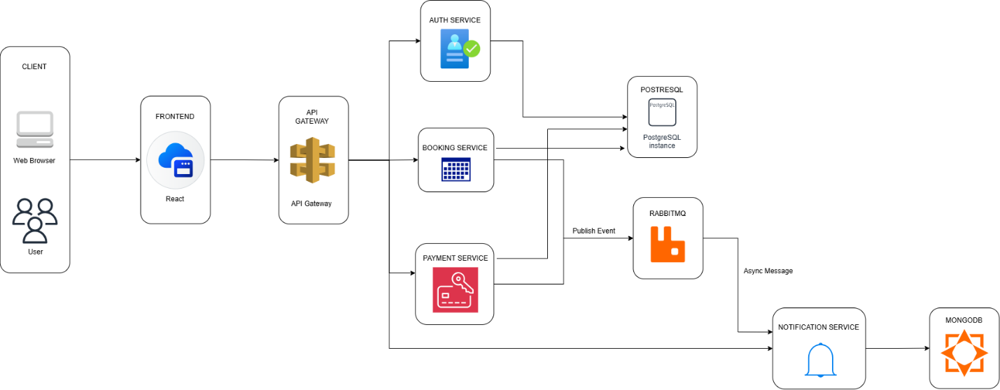
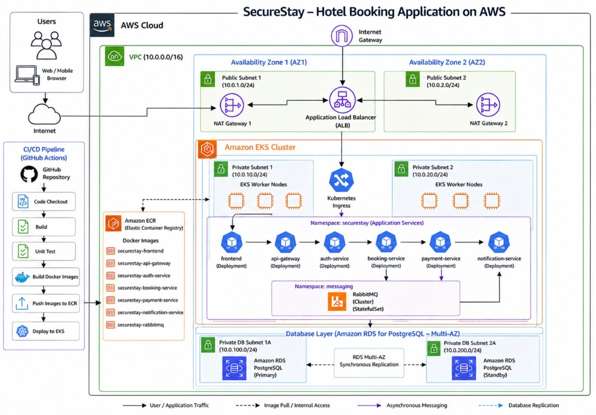
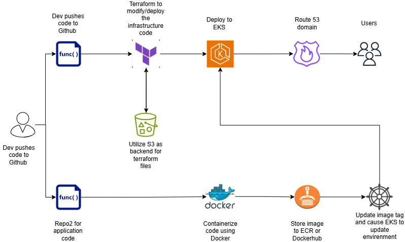

# SecureStay

SecureStay is a cloud-native hotel booking platform built as a microservice system and deployed through a full DevOps workflow. The project starts locally with Docker Compose, can be validated in Kubernetes with Minikube, and can then be moved to AWS by combining this application repository with a separate Terraform infrastructure repository.

If you are evaluating this repository for a demo, viva, interview, or code review, the safest path is:

1. Run it locally with Docker Compose.
2. Validate the Kubernetes path with Minikube.
3. Provision AWS infrastructure from the infrastructure repository.
4. Trigger the GitHub Actions application pipeline to deploy into EKS.

## Repositories

This project uses two public repositories:

- Application repository: [`nimeshayasith/SecureStay`](https://github.com/nimeshayasith/SecureStay)
- Infrastructure repository: [`nimeshayasith/Securestay_infra-pipeline`](https://github.com/nimeshayasith/Securestay_infra-pipeline)

Use the application repository for source code, Docker, Kubernetes manifests, Helm, and the app deployment pipeline.

Use the infrastructure repository for Terraform, AWS networking, EKS, RDS, ECR, state backend bootstrap, and infrastructure pipelines.

## Architecture Snapshots

### 1. Service interaction view

<p align="center">
  
</p>

Note: this early architecture sketch shows MongoDB for notifications. The current implementation stores notification logs in PostgreSQL.

### 2. AWS target architecture

<p align="center">
  
</p>

### 3. Infrastructure and deployment flow

<p align="center">
  
</p>

## What This Project Demonstrates

- Microservice architecture
- API gateway pattern
- JWT authentication and RBAC
- Synchronous and asynchronous service communication
- Docker-based local development
- Kubernetes deployment with Minikube
- AWS deployment with EKS, RDS, ECR, and Terraform
- Remote Terraform state with S3 and DynamoDB
- GitHub Actions CI/CD for both infrastructure and application delivery

## Tech Stack

| Layer | Tools |
| --- | --- |
| Frontend | Node.js, Express static frontend |
| Backend services | Node.js, Express |
| Database | PostgreSQL |
| Messaging | RabbitMQ |
| Containers | Docker, Docker Compose |
| Kubernetes | Minikube, kubectl, Helm |
| Cloud | AWS EKS, RDS, ECR, VPC, IAM, Route 53 support |
| IaC | Terraform |
| CI/CD | GitHub Actions |

## Services and Ports

| Component | Port | Purpose |
| --- | --- | --- |
| Frontend | `3001` locally / `3000` in container | Browser UI |
| API Gateway | `4000` | Public API entry point |
| Auth Service | `4001` | Register, login, JWT |
| Booking Service | `4002` | Hotels, rooms, bookings |
| Payment Service | `4003` | Payments and booking status updates |
| Notification Service | `4004` | RabbitMQ consumer and notification logs |
| PostgreSQL | `5433` locally / `5432` in container | Main relational data store |
| RabbitMQ | `5672` | AMQP messaging |
| RabbitMQ UI | `15672` | RabbitMQ management UI |

## Prerequisites

### Minimum tools

- `git`
- Docker Desktop
- Node.js 20+ and npm
- PowerShell 7+ if you want to use the included smoke-test script

### Additional tools for Kubernetes

- `kubectl`
- `minikube`

### Additional tools for AWS deployment

- `aws` CLI
- `terraform` `1.7.5+`
- `helm`

### Windows quick install example

```powershell
winget install -e --id Git.Git
winget install -e --id Docker.DockerDesktop
winget install -e --id OpenJS.NodeJS.LTS
winget install -e --id Kubernetes.kubectl
winget install -e --id Kubernetes.minikube
winget install -e --id Helm.Helm
winget install -e --id Hashicorp.Terraform
winget install -e --id Amazon.AWSCLI
```

If you use macOS or Linux, install the same tools with the equivalent package manager or from the official vendor docs.

## 1. Clone the Application Repository

Clone the original repository:

```bash
git clone https://github.com/nimeshayasith/SecureStay.git
cd SecureStay
```

If you want to run the pipelines from your own GitHub account, fork the repository first and clone your fork instead:

```bash
git clone https://github.com/<your-github-username>/SecureStay.git
cd SecureStay
```

## 2. Recommended First Run: Docker Compose

This is the fastest and most reliable local path. Run this before trying Minikube or AWS.

### Start the full stack

```bash
docker compose up --build -d
```

### Check container status

```bash
docker compose ps
```

### Open the app

- Frontend: `http://localhost:3001`
- API Gateway health: `http://localhost:4000/health`
- RabbitMQ UI: `http://localhost:15672`

### Quick health checks

```bash
curl http://localhost:4000/health
curl http://localhost:4001/health
curl http://localhost:4002/health
curl http://localhost:4003/health
curl http://localhost:4004/health
```

### Run the included smoke test

```powershell
powershell -ExecutionPolicy Bypass -File .\scripts\integration-smoke.ps1
```

The smoke test:

- starts the stack if needed
- creates a user
- logs in
- searches hotels
- creates a booking
- processes a successful payment
- checks the failed-payment path
- verifies notification events

### Stop the stack

```bash
docker compose down
```

## 3. Run the App in Minikube

Use this path when you want to demonstrate local Kubernetes concepts before moving to EKS.

### Why Minikube is useful

- lets you test deployments, services, probes, and secrets locally
- helps you validate container images before cloud deployment
- gives you a smaller Kubernetes learning environment

### Start Minikube

```bash
minikube start --driver=docker
```

### Build the application images

The current `k8s/*.yaml` files expect the following image names:

```bash
docker build -t lasindu123/auth-service:1.0 ./services/auth-service
docker build -t lasindu123/booking-service:1.0 ./services/booking-service
docker build -t lasindu123/payment-service:1.0 ./services/payment-service
docker build -t lasindu123/notification-service:1.0 ./services/notification-service
docker build -t lasindu123/gateway:1.1 ./gateway
docker build -t lasindu123/frontend:1.0 ./frontend
```

### Load the images into Minikube

```bash
minikube image load lasindu123/auth-service:1.0
minikube image load lasindu123/booking-service:1.0
minikube image load lasindu123/payment-service:1.0
minikube image load lasindu123/notification-service:1.0
minikube image load lasindu123/gateway:1.1
minikube image load lasindu123/frontend:1.0
```

### Apply local Kubernetes resources

Important: `database/schema.sql` is a Kubernetes manifest even though its filename ends with `.sql`. It creates the PostgreSQL ConfigMap, PVC, Service, and Deployment.

```bash
kubectl apply -f k8s/secrets.minikube.yaml
kubectl apply -f database/schema.sql
kubectl apply -f k8s/rabbitmq.yaml
kubectl apply -f k8s/auth.yaml
kubectl apply -f k8s/booking.yaml
kubectl apply -f k8s/payment.yaml
kubectl apply -f k8s/notification.yaml
kubectl apply -f k8s/gateway.yaml
kubectl apply -f k8s/frontend.yaml
```

### Wait for workloads to become healthy

```bash
kubectl get pods -w
```

When all pods are `Running` or `Completed`, stop the watch with `Ctrl+C`.

### Open the local Kubernetes endpoints

```bash
minikube service frontend --url
minikube service gateway --url
```

### Check RabbitMQ management UI in Minikube

```bash
kubectl port-forward service/rabbitmq 15672:15672
```

Then open `http://localhost:15672`.

### Validate the Minikube deployment

```bash
kubectl get pods
kubectl get svc
curl $(minikube service gateway --url)/health
```

## 4. How to Test the Booking Flow

Use the gateway URL from Docker Compose (`http://localhost:4000`) or from Minikube (`minikube service gateway --url`).

### Register

```bash
curl -X POST http://localhost:4000/api/auth/register \
  -H "Content-Type: application/json" \
  -d "{\"fullName\":\"Test User\",\"email\":\"test@example.com\",\"password\":\"SecureStay123\"}"
```

### Login

```bash
curl -X POST http://localhost:4000/api/auth/login \
  -H "Content-Type: application/json" \
  -d "{\"email\":\"test@example.com\",\"password\":\"SecureStay123\"}"
```

Copy the `accessToken` from the response.

### List hotels

```bash
curl http://localhost:4000/api/bookings/hotels
```

### List rooms

```bash
curl "http://localhost:4000/api/bookings/rooms?hotelId=<HOTEL_ID>"
```

### Create a booking

```bash
curl -X POST http://localhost:4000/api/bookings/ \
  -H "Content-Type: application/json" \
  -H "Authorization: Bearer <TOKEN>" \
  -d "{\"roomId\":\"<ROOM_ID>\",\"checkInDate\":\"2026-08-01\",\"checkOutDate\":\"2026-08-03\",\"guestCount\":2}"
```

### Process a successful payment

```bash
curl -X POST http://localhost:4000/api/payments/ \
  -H "Content-Type: application/json" \
  -H "Authorization: Bearer <TOKEN>" \
  -d "{\"bookingId\":\"<BOOKING_ID>\",\"amount\":150,\"paymentMethod\":\"CARD\",\"cardNumber\":\"4111111111111111\",\"cardHolderName\":\"Test User\",\"expiryMonth\":\"12\",\"expiryYear\":\"2030\",\"cvv\":\"123\"}"
```

### Simulate a failed payment

Use `cvv: "000"` to force a failed payment path.

## 5. How to Check Load Balancing Locally

In Minikube, you do not get a real AWS Application Load Balancer. What you do get is Kubernetes Service-level load balancing across pods.

### Check that multiple pods exist

```bash
kubectl get pods -l app=auth-service -o wide
kubectl get pods -l app=booking-service -o wide
```

### Check the service endpoints

```bash
kubectl get endpoints auth-service
kubectl get endpoints booking-service
```

If you see multiple pod IPs behind the same service, Kubernetes is balancing traffic across them.

### Optional scale test

```bash
kubectl scale deployment auth-service --replicas=3
kubectl get pods -l app=auth-service -w
kubectl get endpoints auth-service
```

## 6. Drawbacks of Local Minikube

Minikube is useful, but it is not the same as AWS.

- It usually runs as a single-node cluster.
- It does not give you a real cloud load balancer.
- It does not provide Route 53 DNS, ECR, managed RDS, or EKS-managed control plane behavior.
- It is limited by your laptop CPU, memory, and disk.
- Networking behavior is simpler than a real multi-subnet cloud environment.
- It is good for Kubernetes validation, but not a full production simulation.

## 7. Provision the AWS Infrastructure

Do this only after the local Docker and Minikube paths are clear.

### Clone the infrastructure repository

```bash
git clone https://github.com/nimeshayasith/Securestay_infra-pipeline.git
cd Securestay_infra-pipeline
```

If you want to run the pipelines from your own GitHub account, fork this repository first and clone your fork.

### What infrastructure is used and why

- `VPC` with public and private subnets: network isolation and cleaner security boundaries
- `EKS`: managed Kubernetes control plane
- `RDS PostgreSQL`: managed relational database for persistent business data
- `ECR`: container registry for application images
- `S3` and `DynamoDB`: Terraform remote state and locking
- `IAM`: controlled access for people and AWS services
- `RabbitMQ` in Kubernetes: asynchronous event messaging
- `Route 53` support: optional friendly DNS integration

### Step 1: Configure AWS credentials locally

```bash
aws configure
```

Use an AWS account that has permission to create networking, IAM, EKS, RDS, ECR, S3, and DynamoDB resources.

### Step 2: Bootstrap the Terraform backend

```bash
cd bootstrap
terraform init
terraform apply
```

After this finishes, note the outputs:

- `state_bucket_name`
- `dynamodb_table_name`
- `account_id`

### Step 3: Update the production backend configuration

Open [`environments/prod/backend.tf`](https://github.com/nimeshayasith/Securestay_infra-pipeline/blob/main/environments/prod/backend.tf) and make sure the S3 bucket name matches your AWS account.

The public repo currently points to:

```hcl
bucket = "securestay-terraform-state-209998132740"
```

If you are running this in your own AWS account, update that value to your own bootstrapped bucket name.

### Step 4: Export the required Terraform secrets

PowerShell:

```powershell
$env:TF_VAR_db_password = "<your-rds-password>"
$env:TF_VAR_rabbitmq_password = "<your-rabbitmq-password>"
```

Bash:

```bash
export TF_VAR_db_password="<your-rds-password>"
export TF_VAR_rabbitmq_password="<your-rabbitmq-password>"
```

### Step 5: Plan and apply the production environment

```bash
cd environments/prod
terraform init
terraform validate
terraform plan
terraform apply
```

### Step 6: Capture the Terraform outputs

```bash
terraform output -raw rds_endpoint
terraform output database_url_format
terraform output ecr_repository_urls
terraform output eks_cluster_name
```

You will need these outputs in the application repository pipeline setup.

### Optional Route 53 note

The infrastructure repo supports DNS through `hosted_zone_id`, but it is optional. If you want a Route 53 record in your own AWS account, provide your hosted zone ID during your Terraform setup. If you leave it empty, the platform still works with the AWS-generated load balancer hostname.

## 8. Deploy the Application to AWS EKS

Return to the application repository after the infrastructure is healthy.

```bash
cd ../SecureStay
```

### The current deployment model

- the infrastructure repository prepares AWS, EKS, and cluster platform components
- this application repository builds Docker images and pushes them to ECR
- the application repo then deploys the app into namespace `securestay` using Helm

## 9. Run the Pipelines From Your GitHub Account

If you want the full GitHub Actions experience, fork both repositories into your GitHub account and enable Actions in both forks.

### Infrastructure repo GitHub secrets

In your fork of `Securestay_infra-pipeline`, add these repository secrets:

- `AWS_ACCESS_KEY_ID`
- `AWS_SECRET_ACCESS_KEY`
- `AWS_REGION`
- `TF_VAR_db_password`
- `TF_VAR_rabbitmq_password`

### How the infrastructure pipeline works

- Open a pull request to `main` to trigger `Infrastructure Plan`
- Merge to `main` to trigger `Infrastructure Apply`
- Use manual dispatch for `Infrastructure Destroy` only when you really want to tear everything down

### Application repo GitHub secrets

In your fork of `SecureStay`, add these repository secrets:

- `AWS_ACCESS_KEY_ID`
- `AWS_SECRET_ACCESS_KEY`
- `DATABASE_URL`
- `JWT_SECRET`
- `RABBITMQ_URL`
- `PAYMENT_SECRET`

Use these formats:

- `DATABASE_URL`: `postgresql://securestay_admin:<PASSWORD>@<RDS_ENDPOINT>/securestay?sslmode=require`
- `RABBITMQ_URL`: `amqp://securestay_admin:<RABBITMQ_PASSWORD>@rabbitmq.messaging.svc.cluster.local:5672`
- `JWT_SECRET`: any long random string
- `PAYMENT_SECRET`: any long random string used by the deployment secret bundle

### Trigger the application pipeline

The application pipeline in this repo runs when code is pushed to the `aws_cloud` branch.

```bash
git checkout -b aws_cloud
git push origin aws_cloud
```

Any new push to `aws_cloud` triggers `.github/workflows/app-pipeline.yml`.

That pipeline:

1. generates one image tag for the release
2. builds six Docker images
3. pushes them to ECR
4. connects to EKS
5. creates Kubernetes secrets
6. runs Helm deployment
7. verifies rollouts
8. prints the public frontend endpoint

## 10. How to Test the Cloud Deployment

### Check cluster resources

```bash
kubectl get pods -n securestay -o wide
kubectl get svc -n securestay -o wide
kubectl get pods -n messaging -o wide
```

### Check rollouts

```bash
kubectl rollout status deployment/frontend -n securestay
kubectl rollout status deployment/api-gateway -n securestay
kubectl rollout status deployment/auth-service -n securestay
kubectl rollout status deployment/booking-service -n securestay
kubectl rollout status deployment/payment-service -n securestay
kubectl rollout status deployment/notification-service -n securestay
```

### Get the public frontend endpoint

```bash
kubectl get svc frontend -n securestay -o jsonpath='{.status.loadBalancer.ingress[0].hostname}{"\n"}'
```

### Check logs if something fails

```bash
kubectl logs deployment/frontend -n securestay --tail=80
kubectl logs deployment/api-gateway -n securestay --tail=100
kubectl logs deployment/auth-service -n securestay --tail=100
kubectl logs deployment/booking-service -n securestay --tail=100
kubectl logs deployment/payment-service -n securestay --tail=100
kubectl logs deployment/notification-service -n securestay --tail=100
```

## 11. How to Check Load Balancing in AWS

### Public load balancer check

The current Helm chart exposes the `frontend` service as `LoadBalancer`, so the easiest public check is:

```bash
kubectl get svc frontend -n securestay -o wide
```

If the `EXTERNAL-IP` or hostname is populated, AWS has provisioned the load balancer.

### Backend service balancing check

```bash
kubectl get endpoints api-gateway -n securestay
kubectl get endpoints auth-service -n securestay
kubectl get endpoints booking-service -n securestay
```

If a service has multiple pod IPs behind it, Kubernetes is balancing traffic across those replicas.

### Important note about ingress and Route 53

The infrastructure repo installs NGINX ingress capability, and the Terraform repo supports Route 53 integration, but this application chart currently keeps `ingress.enabled=false` by default in [`helm/securestay/values.yaml`](helm/securestay/values.yaml). That means:

- the fastest working public entry point is the `frontend` `LoadBalancer` service
- custom-domain routing through Route 53 is optional and needs extra configuration in the infra repo and Helm values

## 12. Suggested Learning Order

If someone wants to understand the project end to end, follow this order:

1. Read the architecture diagrams.
2. Run Docker Compose locally.
3. Run the smoke test.
4. Move to Minikube and inspect pods, services, probes, and secrets.
5. Clone the Terraform repository and provision AWS.
6. Configure GitHub secrets in both forks.
7. Trigger the infrastructure pipeline.
8. Trigger the application pipeline.
9. Validate the EKS deployment and public endpoint.

## 13. Project Structure

```text
frontend/                Frontend application
gateway/                 API gateway
services/auth-service/   Authentication service
services/booking-service/ Booking service
services/payment-service/ Payment service
services/notification-service/ Notification consumer
database/                Local PostgreSQL bootstrap manifest and schema
k8s/                     Local Kubernetes manifests
helm/securestay/         Helm chart used by the cloud app pipeline
scripts/                 Helper scripts, including the smoke test
.github/workflows/       GitHub Actions workflows
docs/                    Supporting documentation and architecture assets
```

## 14. Final Notes

- Start with Docker Compose if your goal is simply to run the project.
- Use Minikube when you need to demonstrate Kubernetes locally.
- Use the Terraform repository before attempting any EKS deployment.
- Use your own GitHub fork plus repository secrets if you want the pipelines to run from your account.

If you follow the order in this README, you can move from a local microservice demo to a cloud-native AWS deployment with a real DevOps workflow.
