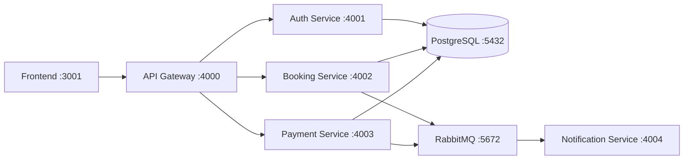

# SecureStay Microservice Architecture

This document explains the microservice architecture used in the current SecureStay implementation.

## 1. Architecture Style

SecureStay uses a **microservices + API Gateway** architecture with:

- synchronous REST communication for request/response flows
- asynchronous event-driven communication for cross-service notifications
- shared infrastructure (PostgreSQL and RabbitMQ) for the MVP phase

## 2. Service Map

- **Frontend** (`frontend/`): user interface for booking flow
- **API Gateway** (`gateway/`): single client entry point and request router
- **Auth Service** (`services/auth-service/`): registration, login, JWT profile
- **Booking Service** (`services/booking-service/`): hotel/room browsing, availability, bookings
- **Payment Service** (`services/payment-service/`): payment processing and booking status updates
- **Notification Service** (`services/notification-service/`): consumes booking/payment events
- **PostgreSQL**: transactional persistence
- **RabbitMQ**: event messaging backbone

## 3. Request Flow (Synchronous)

### Client-facing flow

1. Frontend sends requests to API Gateway (`:4000`)
2. Gateway routes to internal services:
- `/api/auth/*` -> Auth Service (`:4001`)
- `/api/bookings/*` -> Booking Service (`:4002`)
- `/api/payments/*` -> Payment Service (`:4003`)

### Internal service-to-service flow

- Payment Service calls Booking Service internal endpoints:
- `GET /internal/bookings/{bookingId}`
- `PATCH /internal/bookings/{bookingId}/status`

This is used to:

- validate booking before payment
- update booking status after payment result

## 4. Event Flow (Asynchronous)

Services publish domain events to RabbitMQ exchange `securestay.events`:

- Booking Service:
- `booking.created`
- `booking.status.updated`

- Payment Service:
- `payment.processed`

Notification Service subscribes to:

- `booking.*`
- `payment.*`

and records consumptions in its in-memory notification log endpoint.

## 5. Data Ownership (Current MVP)

Logical ownership by service:

- Auth Service: `users`
- Booking Service: `hotels`, `rooms`, `bookings`
- Payment Service: `payments`
- Notification Service: notification logs (currently in-memory, not DB table)

For MVP speed, all services connect to the same PostgreSQL instance, while still maintaining **logical service boundaries** in code.

## 6. Security Model

- Passwords are hashed (bcrypt)
- Auth Service issues JWT access tokens
- Protected routes in Booking/Payment require `Authorization: Bearer <token>`
- Gateway supports browser access with CORS for local frontend origins

## 7. Why This Architecture Was Chosen

This structure fits the project goals and timeline:

- clear service boundaries for team parallel work
- scalable pattern (API gateway + independent services)
- event-driven extension point for notifications
- simple local deployment with Docker Compose

## 8. Current Constraints and Trade-offs

- Shared DB instance (not separate DB per service yet)
- Payment gateway is simulated (CVV `000` -> failed payment)
- Notification persistence is in-memory
- Internal service calls are direct REST (no service mesh)

These are acceptable for the MVP and can be evolved later.

## 9. Suggested Evolution Path

1. Move to per-service databases for stricter isolation.
2. Add schema migration tooling (e.g., Flyway/Prisma migrations).
3. Persist notifications in DB with query endpoints.
4. Add API contract validation middleware from OpenAPI specs.
5. Add centralized observability (logs, tracing, metrics).
6. Add CI/CD checks for contract + integration tests.

## 10. High-level Diagram

