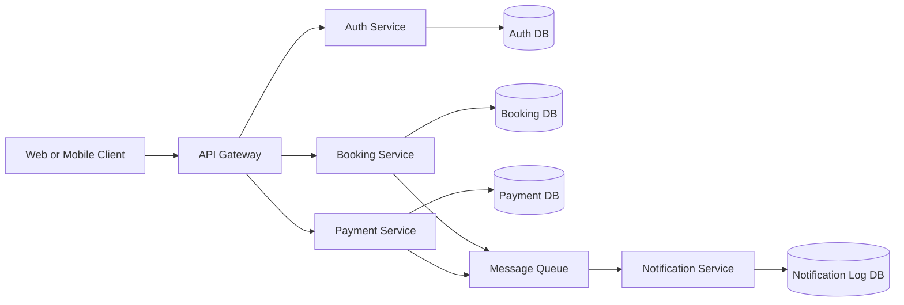

# Step 01: Finalize Scope and Architecture

## 1. Project goal

SecureStay is a secure hotel reservation platform that allows users to:

- register and log in
- browse available rooms
- create bookings
- make payments
- receive booking notifications

The system is designed as independent microservices connected through an API Gateway and asynchronous messaging where appropriate.

## 2. MVP scope

The minimum viable product for the 2-day implementation is:

- user registration and login with JWT-based authentication
- hotel room listing and availability lookup
- booking creation and booking status tracking
- payment submission and payment status update
- notification sending after successful booking or payment
- centralized entry point through an API Gateway

## 3. Out of scope for the MVP

To keep the project achievable within the planned timeline, these items should not be part of the first implementation:

- advanced hotel search filters
- refund workflows
- third-party payment gateway integration
- live inventory sync with external systems
- admin dashboards
- complex recommendation features

## 4. Microservices

### Auth Service

Responsibilities:

- user registration
- login
- password hashing
- JWT generation and validation support
- user profile lookup

Suggested data ownership:

- users
- roles
- credentials metadata

### Booking Service

Responsibilities:

- room listing
- room availability
- booking creation
- booking confirmation state
- booking history

Suggested data ownership:

- hotels
- rooms
- bookings

### Payment Service

Responsibilities:

- record payment requests
- mark payment success or failure
- publish payment outcome events

Suggested data ownership:

- payments
- transaction references

### Notification Service

Responsibilities:

- consume booking or payment events
- send confirmation notifications
- maintain notification logs

Suggested data ownership:

- notifications
- delivery status logs

### API Gateway

Responsibilities:

- route external requests to internal services
- act as the single client-facing endpoint
- enforce authentication for protected routes
- support future rate limiting and request logging

## 5. Proposed technology stack

The document did not include an extractable body text copy in this workspace, so the stack below is a practical Step 01 proposal that matches the project headings in the PDF.

- Frontend: React
- API Gateway: Spring Cloud Gateway or an Express-based gateway
- Services: Spring Boot or Node.js microservices
- Databases: PostgreSQL for transactional data, or one database per service if the team prefers strict service ownership
- Messaging: RabbitMQ
- Authentication: JWT with BCrypt password hashing
- Containers: Docker

## 6. Recommended service boundaries

To keep coupling low:

- Auth Service owns user identity and credentials only
- Booking Service does not store passwords or payment card details
- Payment Service does not own booking rules; it only processes payment state
- Notification Service does not decide business outcomes; it reacts to events
- Gateway handles routing, not business logic

## 7. High-level architecture

## 8. Core flow

### User onboarding

1. A user registers through the API Gateway.
2. The Auth Service stores the user and returns a JWT after login.

### Booking flow

1. The user views available rooms through the Booking Service.
2. The user creates a booking request.
3. The Booking Service creates a pending booking.
4. The user submits payment.
5. The Payment Service stores the payment result.
6. The Payment Service or Booking Service emits an event.
7. The Notification Service sends a confirmation message.

## 9. Security baseline

The minimum security baseline for this project should be:

- hashed passwords with BCrypt
- JWT for stateless authentication
- protected booking and payment endpoints
- environment-based secret configuration
- request validation on every service
- no hardcoded credentials in source code

## 10. Team alignment checklist for Step 01

Step 01 should be treated as complete when the team agrees on:

- the exact MVP features
- the selected services
- who owns each service
- the API Gateway entry point
- the chosen database approach
- the event flow for notifications
- the minimum security controls

## 11. Recommended next step

After this, Step 02 should prepare the repository layout based on the architecture above, for example:

- `gateway/`
- `services/auth-service/`
- `services/booking-service/`
- `services/payment-service/`
- `services/notification-service/`
- `docs/`
